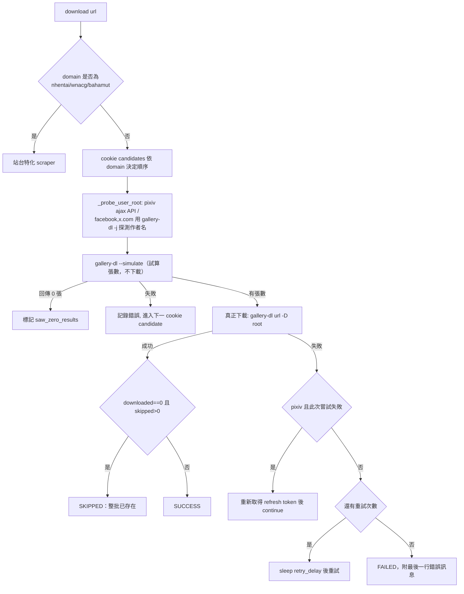

## 設計說明

`app/providers/gallery_dl/provider.py`（236 行）是「gallery-dl」provider 的統一入口
`download(url, tokens, max_retries=5, retry_delay=5, metadata=None)`，同時扮演兩個角色：

1. **站台特化分派器**：`nhentai.net` → `BP-PROV-NHENTAI-1`、`wnacg.com` →
   `BP-PROV-WNACG-1`、`forum.gamer.com.tw`/`gamer.com.tw` → `BP-PROV-BAHAMUT-1`（含
   `selected_urls` 精準下載）。這三站繞過真正的 gallery-dl CLI，直接用內建 scraper。
2. **通用 gallery-dl CLI 包裝**：其餘所有 `GALLERY_DL_DOMAINS`（pixiv/danbooru/
   patreon/civitai/deviantart/…，見 `app/config/settings.py`）走真正的 `gallery-dl`
   子行程，流程：

### 關鍵行為細節

- **Cookie 候選順序依網域客製**（`_cookie_candidates`）：X/Twitter 先不帶 cookie
  再帶；Facebook 先帶 cookie 再不帶——因兩站對 cookie 存在與否的反應不同（部分頁面
  帶 cookie 反而觸發驗證牆）。
- **使用者根目錄探測**（`_probe_user_root`）：Pixiv 用官方 ajax API；Facebook/X
  用 `gallery-dl -j`（JSON dump 模式）取得作者名，讓下載落在
  `download/pixiv.net/<author>/` 這類分層路徑（`BP-SVC-PATH-1`）。
- **錯誤訊息萃取**（`_last_error_line`）：gallery-dl 錯誤格式固定為
  `[<name>][error] <message>`（已對照真實 CLI 輸出驗證），優先抓這類行，否則退回最後
  一行非空輸出，確保 job 的 `error` 欄位永遠有可讀診斷文字。
- **與 `BP-SVC-UPDATER-1` 的整合點**：此 provider 本身不觸發更新——是呼叫方
  `download_service.download_request`（`BP-SVC-DOWNLOAD-1`）在偵測到失敗訊息符合
  「疑似過期擷取器」特徵時才觸發 reactive 更新重試，本 provider 只負責把診斷字串
  乾淨地往上傳。

### 誠實現況

沒有針對本檔的獨立 pytest 覆蓋（`tests/test_gallery_dl_error_capture.py` 只測
`_last_error_line` 錯誤訊息萃取這一小段邏輯，不含完整 `download()` 流程）；`--simulate`
先行試算的成本（每次下載都先跑一次完整模擬）未量化，屬效能上的已知取捨，非缺陷。
