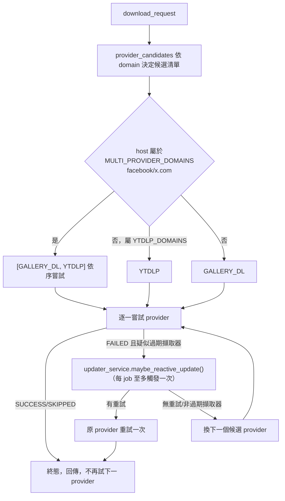

## 設計說明

`app/services/download_service.py`（203 行）是整個下載流程的中樞，三種呼叫來源
（CLI 批次模式 `app/main.py::run_batch_download`、Discord bot `BP-BOT-1`、佇列 worker
`BP-SVC-QUEUE-1`）最終都收斂到這裡的 `download_request()`。

### 舊縮寫展開（`expand_url_shortcut`）

`p123`/`pw123` → Pixiv artwork、`pu123` → Pixiv user、`n123` → nhentai gallery、
`w123` → wnacg photo index。CLI 批次模式（`dl.txt`）與 Discord bot 訊息解析都走
這個共用函式，維持行為一致。

### Provider 分流與 fallback 鏈（`provider_candidates` / `download_request`）

- **每 job 硬上限一次**自動更新重試（`update_retry_used` 旗標），避免更新→失敗→更新
  無限迴圈——即使一個 job 有多個候選 provider 也只觸發一次。
- 每次嘗試都記錄進 `attempts` 清單（provider/status/error/是否為自動更新重試），
  最終寫入 job 的 `meta.attempts`，供前端 Jobs 頁（`BP-VIEW-JOBS-1`）與歷史紀錄
  追溯完整重試軌跡。

### 誠實現況

`tests/test_download_service.py` + `test_download_service_reactive_update.py` 對
`provider_candidates`／reactive 更新整合路徑有 pytest 覆蓋；完整端到端下載（實際呼叫
provider 子行程）未覆蓋（provider 層各自的誠實現況見對應 `BP-PROV-*` 條目）。
